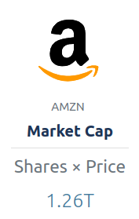

# Wordpress Financial Ratio Block

[](https://github.com/xelonic/wordpress-financial-ratio-block/actions/workflows/build.yml)

* Contributors:      xelonic capital GmbH
* Tags:              block
* Tested up to:      6.1
* Stable tag:        1.0.0

Provides a block for Wordpress that displays a financial ratio of a company.

## Description

This plugin enables a block in the `embed` category to display a financial ratio of a target company. There a
number of ratios to choose from, for example price/earnings, price/book or market capitalization.

The block will invoke an API from <a href="https://xelonic.com" target="_blank">xelonic.com</a> to retrieve it's data.
**There's no account required to use this data!**


## Installation

*This plugin is in review at Wordpress. Until then the only way to install it is by uploading the plugin zip
to your Wordpress installation.*

1. Upload and unpack the [plugin zip](https://github.com/xelonic/wordpress-financial-ratio-block/releases/download/v1.0.0/financial-ratio-block.zip)
   to your wordpress installation at `<wordpress installation>/wp-content/plugins`.
2. Activate the plugin through the 'Plugins' screen in WordPress.

Now the block is ready-to-use.

1. In the block editor search for `financial ratio` and add it to your page.
2. Configure the block using the right sidebar.

## Screenshots



## Local Development

This plugin is based on the code skeleton `@wordpress/create-block` and was initially generated with

```bash
npx @wordpress/create-block financial-ratio-block --wp-env
```

### Manage the dev environment

Make sure you use node version 14. This can be done by using the tool `nvm` (a corresponding `.nvmrc`
is in the project directory). And then:

```bash
nvm install
nvm use
```

Inside the project directory:

```bash
npm install
```

Then start the wordpress instance:

```bash
npm run env -- start
```

Then start the hot-update mechanism for development:

```bash
npm run start
```

When you're done, stop the environment:

```bash
npm run env -- stop
```

To get fully rid of the state (including docker volumes) run:

```bash
npm run env -- destroy
```

### Configure Wordpress

Then you can navigate to wordpress, by default on `http://localhost:8888`. There you have to activate the plugin
for the block.

The default username is `admin` with password `password`.

* go to `Plugins`
* activate `Financial Ratio`
* go to `Appearance` -> `Editor`
* click inside the big editor
* on the upper-left click on the `+`
* search for `financ`
* drag & drop the block somewhere and edit it

### Test with a plain wordpress

You can use the `docker-compose.yml` in this repo to test it:

```bash
docker-compose up -d
```

Then later remove it fully again with:

```bash
docker-compose down -v
```
